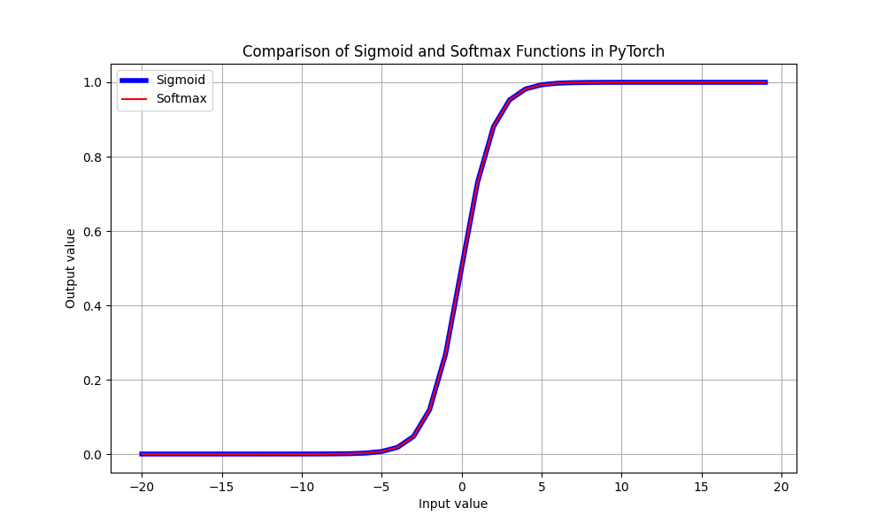

# Sigmoid vs SoftMax

Funkcje sigmoid oraz softmax w pytorch działają w ten sam sposób - konwertują wartości do przedziału [0, 1]

Zaletą funkcji SoftMax w pytorch jest możliwość zastosowania jej do problemu gdzie na wyjściu sieci mamy wiele wartości. Funkcja SoftMax potrafi tak przeskalować kilka wyjść aby ich suma wynosiła 1. Służy do tego parametr dim= 

https://pytorch.org/docs/stable/generated/torch.nn.Softmax.html

https://pytorch.org/docs/stable/generated/torch.nn.Sigmoid.html

Wyjaścienie działania funkcji softmax:

https://www.youtube.com/watch?v=KpKog-L9veg