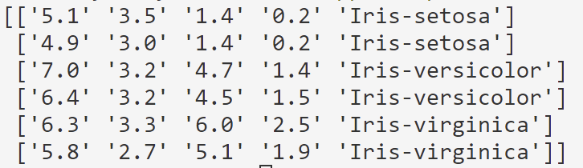
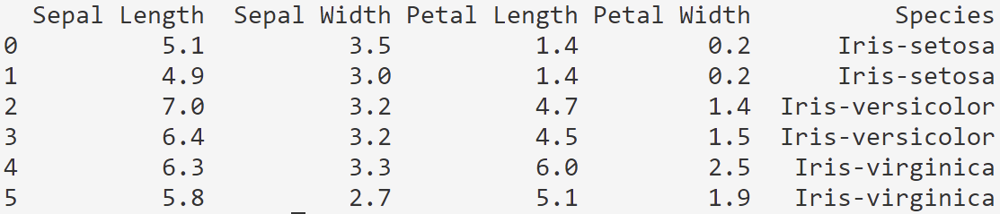

# Python - podstawowe operacje

## Macierze i Tensory
W kontekście Sztucznej Inteligencji, macierze są fundamentalnym narzędziem do przechowywania i przetwarzania danych. Są strukturami danych składającymi się z wierszy i kolumn, które umożliwiają organizację danych w postaci tabelarycznej. W kontekście języka python macierz będą tworzyć listy zawarte w liście "opakowującej".

<div class="codeblock-label">pure python</div>

```python
# Macierz o wymiarach 4 wiersze 3 kolumny
matrix = [[1, 2, 3],
    [5, 3, 6],
    [4, 5, 6],
    [7, 8, 9]]
```

Gdy zachodzi potrzeba zastosowania większej liczby wymiarów niż posiada macierz stosuje się Tensory które są rozszerzeniem pojęcia macierzy, gdzie macierz to specjalny przypadek tensora dwuwymiarowego. W przetwarzaniu obrazów, obrazy cyfrowe są często reprezentowane jako tensory, gdzie dwa pierwsze wymiary odpowiadają za wysokość, szerokość a kolejne za kanały kolorów (np. czerwony, zielony, niebieski).

Oto przykładowa trójwymiarowa macierz reprezentująca niewielki obraz RGB o rozmiarze 3x3 pikseli:

<div class="codeblock-label">pure python</div>

```python
image = [
    [[255, 0, 0], [0, 255, 0], [0, 0, 255]],
    [[255, 255, 0], [255, 255, 255], [0, 255, 255]],
    [[128, 128, 128], [0, 0, 0], [255, 128, 128]]
]
```

Wskaźniki indeksujące w macierzach i tensorach są sposobem określania konkretnych elementów w tych strukturach danych. Pozwalają one na odwoływanie się do określonych wartości poprzez podanie odpowiednich indeksów, które określają położenie elementu w macierzy lub tensorze.

<div class="codeblock-label">pure python</div>

```python
# Macierz A
A = [
    [1, 2, 3],
    [4, 5, 6],
    [7, 8, 9]
]

# Tensor T
T = [
    [
        [1, 2],
        [3, 4]
    ],
    [
        [5, 6],
        [7, 8]
    ]
]

# Odwołanie do elementów macierzy A i tensora T za pomocą wskaźników indeksujących
element_A = A[1][2]  # Odwołanie do elementu w drugim wierszu i trzeciej kolumnie macierzy A
element_T = T[0][1][0]  # Odwołanie do elementu w pierwszym wymiarze, drugim wierszu i pierwszej kolumnie tensora T
```

> W języku python dane indeksowane są od 0.

## Numpy i Pandas

Biblioteki NumPy i pandas są dwiema popularnymi bibliotekami w języku Python używanymi do pracy z danymi numerycznymi i analizy danych. Zapewniających wsparcie dla operacji na tablicach wielowymiarowych oraz funkcje matematyczne do pracy z tymi tablicami. Kod napisany z wykorzystaniem tych bibliotek wykonuje się znacznie szybciej niż kod napisany tylko z wykorzystaniem podstawowej składni python szczególnie przy dużych zbiorach danych. 

Biblioteka Pandas bazuje w dużej mierze na bibliotece Numpy i rozszerza jej funkcjonalności. Umożliwia czytelniejsze dla użytkownika działania na macierzach przez np. selekcję danych przez nazwy kolumn. Zawiera też szereg funkcji umożliwiających wizualizację danych.

Poniżej znajdują się strony domowe obu bibliotek:

<https://numpy.org/>

<https://pandas.pydata.org/>

> Stosuj Numpy gdy chcesz uzyskać szybki kod

> Stosuj Pandas jeśli przetwarzasz dane, często sprawdzasz zawartość macierzy i zależy ci na czytelnosci kodu (nazwa kolumny będzie więcej mówić użytkownikowi niż index)


## Zadania

[Utwórz](https://si.lazysolutions.pl/lab1/PythonIDE.html#instalacja-bibliotek) nowy projekt o nazwie Lab1. Następnie [zainstaluj](https://si.lazysolutions.pl/lab1/PythonIDE.html#instalacja-bibliotek) biblioteki `Numpy` oraz `Pandas` w odpowiedniej wersji. 

Dodaj import biblioteki [numpy](https://numpy.org/doc/stable/user/absolute_beginners.html#how-to-import-numpy) oraz [pandas](https://pandas.pydata.org/docs/user_guide/10min.html#minutes-to-pandas).

### Konwersja danych "pure python" do numpy

W projekcie [utwórz skrypt](https://si.lazysolutions.pl/lab1/PythonIDE.html#instalacja-bibliotek) `data_operations.py`. 

Następnie utwórz zminną `iris_data` która będzie przechowywać dane na temat irysów w dwu wymiarowej tablicy.

| Sepal Length | Sepal Width | Petal Length | Petal Width | Species        |
|--------------|-------------|--------------|-------------|----------------|
| 5.1          | 3.5         | 1.4          | 0.2         | Iris-setosa    |
| 4.9          | 3.0         | 1.4          | 0.2         | Iris-setosa    |
| 7.0          | 3.2         | 4.7          | 1.4         | Iris-versicolor|
| 6.4          | 3.2         | 4.5          | 1.5         | Iris-versicolor|
| 6.3          | 3.3         | 6.0          | 2.5         | Iris-virginica |
| 5.8          | 2.7         | 5.1          | 1.9         | Iris-virginica |

Zapoznaj się z dokumentacją:

<https://numpy.org/doc/stable/reference/generated/numpy.array.html>

Następnie utwórz zmienną `np_iris` do której przypiszesz dane ze zmiennej `iris_data` przekształcone na macierz numpy. Wypisz zmienną `np_iris` w konsoli za pomocą funkcji [`print`](https://docs.python.org/3/tutorial/inputoutput.html)

Przykładowy rezultat w konsoli:


> Zauważ że dane są w postaci łańcuchów znaków o czym świadczą `'` okalające dane liczbowe aby możliwe było wykonanie na nich operacji arytmetycznych dane muszą mieć odpowiedni typ. W celu konwersji możliwe jest użycie parametru `dtype=object` w funkcji `np.array()` co oznacza, że każdy element tablicy NumPy będzie traktowany jako obiekt Pythona.

### Konwersja do formatu Pandas

Zapoznaj się z dokumentacją:

<https://pandas.pydata.org/pandas-docs/version/2.1/reference/api/pandas.DataFrame.html>

W skrypcie `data_operations.py` dodaj zmienną `pd_iris` do której przypiszesz zawartość zmiennej `iris_data` przekonwertowanej na do typu `DataFrame` tak aby po wyświetleniu zawartości zmiennej `pd_iris` rezultat był następujący (dodane są nazwy kolumn):



### Indeksowanie

Zapoznaj się z [dokumentacją](https://numpy.org/doc/stable/user/basics.indexing.html) i przeanalizuj przykłady a następnie wykonaj poniższe polecenia:

1. Utwórz zmienną `M` przez skopiowanie do niej 1 i 2 wiersza oraz 3 i 4 kolumny z macierzy `np_iris`

2. Utwórz zmienną `v` przechowującą wektor (tablice 1 wymiarową) zawierający dane:

```
1, 2, 3, 4, 5, 6
```

następnie podmień dane z 4 kolumny macierzy `np_iris` na dane z utworzonego wektora.

3. Utwórz zmienną `x` przechowującą co [drugą wartość](https://numpy.org/doc/stable/user/basics.indexing.html#:~:text=slice%20syntax%20is-,i%3Aj%3Ak,-where%20i%20is) z wektora `v` od tyłu.

4. Z macierzy `np_iris` wybierz 1 wiersz a następnie przekształć go na kolumnę używając funkcji [`reshape`](https://numpy.org/doc/1.25/reference/generated/numpy.reshape.html) lub [`transpose`](https://numpy.org/doc/stable/reference/generated/numpy.ndarray.T.html) ([`T`](https://numpy.org/doc/stable/reference/generated/numpy.ndarray.T.html#)).

5. Utwórz zmienną `iris_classes` w której z macierzy `np_iris` wybierz ostatnią kolumnę zawierającą gatunki irysów. Zmień dane pod 3,4,5 i 6 indeksem na "Iris-setosa". Czy po zmianie danych w `iris_classes` dane w `np_iris` również uległy zmianie? Spróbuj temu zapobiec używając funkcji [`copy`](https://numpy.org/doc/stable/reference/generated/numpy.copy.html).

### Operacje na macierzach

#### Dodawanie

Mając podane macierze wyznacz [sumę](https://numpy.org/doc/stable/reference/routines.math.html) macierzy A + B:

```python
A = np.array([[1, 2], [3, 4]])
B = np.array([[5, 6], [7, 8]])
```

#### Mnożenie przez skalar

[Pomnóż](https://numpy.org/doc/stable/reference/routines.math.html) macierz A przez liczbę 2

#### Obliczanie średniej

Oblicz [średnią](https://numpy.org/doc/stable/reference/routines.statistics.html) wartość 1 kolumny w macierzy B.

#### Macierz odwrotna

Wyznacz [macierz odwrotną](https://numpy.org/doc/stable/reference/routines.linalg.html#) do macierzy A

#### Rozwiąż układ równań

Mając poniższe dane [rozwiąż układ](https://numpy.org/doc/stable/reference/routines.linalg.html#) równań X z=y:

```python
X = np.array([[1, 2], [3, 4]])
y = np.array([5, 6])
```

### Łączenie macierzy w pionie

[Połacz macierze](https://numpy.org/doc/stable/reference/generated/numpy.concatenate.html) A oraz B tak aby utworzyły macierz o 4 wierszach i 2 kolumnach

### Łączenie macierzy w poziomie

[Połacz macierze](https://numpy.org/doc/stable/reference/generated/numpy.concatenate.html) A oraz B tak aby utworzyły macierz o 4 kolumnach i 2 wierszach

## Zadania* 

Zapisane są pomiary temperatury w różnych miastach w kolejnych miesiącach:

```yaml
"Miasto","Styczeń","Luty","Marzec","Kwiecień","Maj"
"Warszawa",-2,0,5,10,15
"Kraków",-4,-1,3,8,12
"Gdańsk",0,2,6,11,16
"Poznań",-1,1,4,9,14
"Wrocław",-3,0,5,10,15
```

Za pomocą biblioteki NumPy w uzyskaj następujące informacje:

1. Średnia temperatura dla każdego miasta.
2. Najwyższa temperatura w każdym miesiącu dla każdego miasta.
3. Miesiąc, w którym średnia temperatura była najwyższa we wszystkich miastach.
4. Miesiąc, w którym wystąpiła największa różnica temperatur między miastami.
5. Średnia temperatura dla wszystkich miast w każdym miesiącu.
6. Miesiące, w których temperatura w danym mieście była wyższa niż średnia dla wszystkich miast.
7. Różnica temperatur między kolejnymi miesiącami dla każdego miasta.


