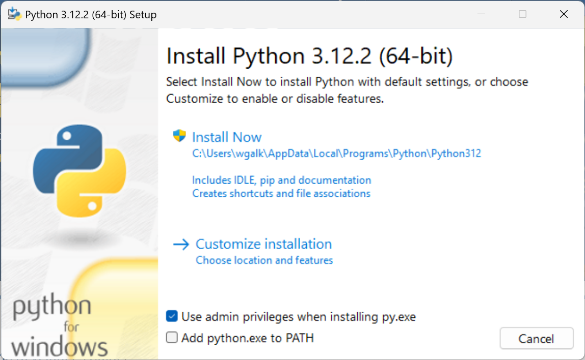
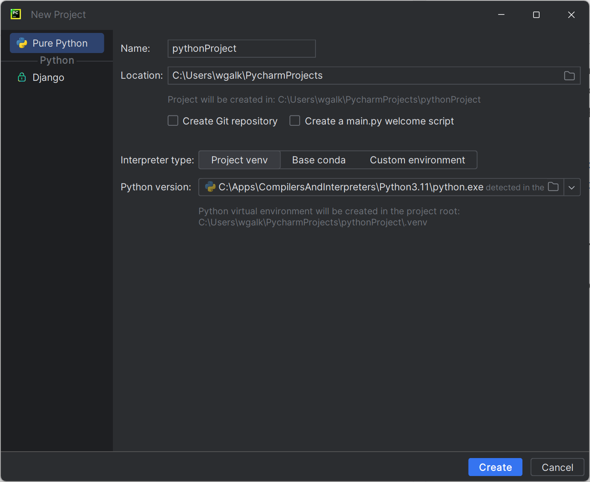

## Praca w środowisku Python

### Instalacja

Python to wysokopoziomowy, interpretowany język programowania ogólnego przeznaczenia. Interpreter dostępny na różne systemy operacyjne można pobrać ze strony:

<https://www.python.org/downloads/>

Podczas instalacji na systemie Windows ważnye jest:

1. Dodanie pythona do zmiennych środowiskowych

Dzięki temu interpreter będzie dostępny bezpośrednio w systemie (nie dodając pythona do zmiennych środowiskowych chcąc włączyć interpreter potrzebna będzie cała ścieżka do pliku `python.exe`). 

2. Korzystając z instalacji zaawansowanej dobrze zainstalować `pip` czyli narzędzie pozwalające w łatwy sposób instalować potrzebne biblioteki i frameworki.
 

3. Przy instalacji zaawansowanej warto też wybrać opcję dodania pythona do zmiennych środowiskowych (odpowiednik punktu 1 z instalacji ekspresowej).

### IDE

Praca z interpreterem możliwa jest z poziomu konsoli jednak można ułatwić sobie pracę korzystając z IDE(Zintegrowane środowisko programistyczne). Popularnym oprogramowaniem w tej kwesti jest:
- [PyCharm](https://www.jetbrains.com/pycharm/)
- [VisualStudio Code](https://code.visualstudio.com/)
- [Jupyter Notebooks](https://jupyter.org/)
- [IDLE](https://docs.python.org/3/library/idle.html)

#### Praca w Pycharm

##### Tworzenie nowego projektu

W oknie tworzenia projketu najważniejszym elementem jest wskazanie interpretera Python dla danego projektu. Dostępne są 3 opcje, podstawowa `Project venv` utworzy wirtualne środowisko Python w katalogu .venv wewnątrz projektu na bazie wskazanego interpretera.

Wirtualne środowisko odizoluje biblioteki użyte w projekcie od globalnego interpterera python.

Po kliknięciu `Create` należy poczekać aż IDE zaindeksuje(niebieski pasek wczytywania w prawym dolnym rogu) i utworzy potrzebne katalogi i pliki. Pomyślnie utworzenie projektu będzie sygnalizowane wyświetleniem drzewa projektu z lewej strony

##### Tworzenie nowego skryptu

Aby utworzyć nowy skrypt python należy w drzewie projektu na głownym katalogu klinąć prawym przyciskiem myszy, a następnie `new` > `python file`. Wprowadzić nazwę skryptu i zatwierdzić klawiszem enter.

##### Uruchomienie skryptu

W oknie ze skryptem kliknąć prawym klawiszem myszy a następnie wybrać opcję run.

W dolnej części ekranu pojawi się konsola z rezultatem działania skryptu.

##### Instalacja bibliotek

W lewym dolnym rogu należy wybrać opcję `Python packages`

W oknie wyszukiwania należy wpisać nazwę poszukiwanej biblioteki np. `numpy`. Następnie wybrać jej wersję po czym kliknąć Install Package

> Wersję biblioteki należy dobrać do wersji Pythona. Najlepiej skorzystać z dokumentacji wybranej biblioteki w celu określenia z jaką wersją działa.

##### Debugowanie programu

W oknie z treścią programu należy zaznaczyć linię do której chcemy aby program się wykonywał a następnie wypisywał zawartość zmiennych w oknie oebugowania.

Aby zacząć debugowanie kliknij prawym przyciskiem w oknie ze skryptem i wybierz opcję `Debug`

Python zacznie wykonywać instrukcje aż do miejsca oznaczonego czerwoną kropką. Następnie w konsoli wyświetlą się wartości zmiennych do tego miejsca w programie:

Zieloną ikonką możemy wznowić działanie skryptu aż do kolejnego zaznaczonego punktu.

> W konsoli będą widoczne wyniki do danej lini w kodzie. Jeśli chcemy zobaczyć wartości zmiennych w pętli możliwe jest dodanie instrukcji continue na końcu i wskazanie jej jako "beakpointu".