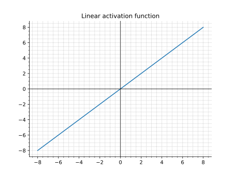
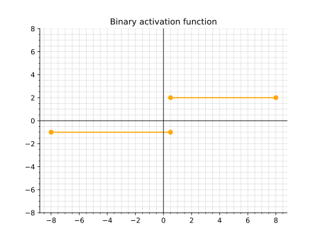
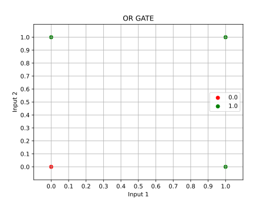
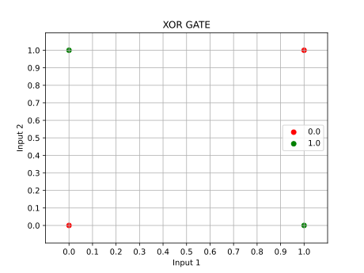
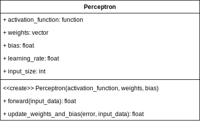

## Perceptron

## Zagadnienia

### Budowa perceptronu


#### Funkcje aktywacji

##### Funkcja liniowa



$$
f(x) = x
$$

##### Funkcja binarna

W funkcji binarnej ustawiamy pewną wartość t (treshold) powyżej której funkcja przyjmie pewną wartość, a poniżej inną. 

Przykładowo możemy przyjąć wartoś t=0.5 poniżej której funkcja zwróci -1, a powyżej zwróci 2.



##### SoftMax

##### ReLU

##### Sigmoidalna

##### Tangens hiperboliczny

### Uczenie perceptronu

Uczenie perceptronu polega na aktualizacji wag oraz wartości bias. Proces uczenia można wyrazić następującą listą kroków:

1. **Inicjalizacja wag i biasu:** Na początku procesu uczenia wagi połączeń między wejściami a perceptronem oraz wartość biasu są zazwyczaj inicjalizowane losowo lub przy użyciu pewnych ustalonych wartości początkowych.
2. **Przekazanie danych treningowych:** Do perceptronu są dostarczane dane treningowe w postaci wektorów cech.
3. **Obliczenie wyjścia perceptronu:** Na podstawie dostarczonych danych wejściowych oraz aktualnych wartości wag i biasu obliczane są wyjścia perceptronu.
4. **Porównanie wyjścia z oczekiwanym wynikiem:** Wyjścia uzyskane przez perceptron są porównywane z oczekiwanymi wartościami etykiet, aby określić, czy perceptron dokonał poprawnej predykcji dla danego przykładu.
5. **Korekta wag i biasu:** W przypadku, gdy perceptron dokonał błędnej predykcji, następuje **korekta wartości wag i biasu w celu zminimalizowania błędu**. Zazwyczaj używane są metody optymalizacji, takie jak **metoda gradientu prostego**, aby dostosować wagi i bias perceptronu tak, aby zmniejszyć **błąd predykcji (najprostsza receptura to odejmowanie: oczekiwana decyzja - predykcja)**.

    $$
    w_i \leftarrow w_i + \eta \cdot (y - \hat{y}) \cdot x_i
    $$

    $$
    b \leftarrow b + \eta \cdot (y - \hat{y})
    $$

    gdzie

    - $w_i$ - to waga dla i-tego wejścia,
    - η - współczynnik uczenia (learning rate),
    - y - rzeczywista etykieta,
    - $\hat{y}$ - przewidywana etykieta,
    - $x_i$ - i-te wejście,
    - b - bias.

6. **Powtarzanie procesu:** Proces korekty wag i biasu na podstawie kolejnych próbek danych treningowych jest powtarzany przez wiele **epok (iteracji)** lub do momentu osiągnięcia zadowalającej wydajności na danych treningowych.

## Zadania

Perceptron prosty jest w stanie poradzić sobie z problemami liniowo separowalnymi np. może być wykorzystany do rozwiązania problemu bramki logicznej, czyli do zaprogramowania go tak, aby działał jak określona bramka logiczna, takie jak bramka OR, AND lub XOR.

Przyjmiemy dwa zbiory uczace - brakmi OR oraz XOR. Nasze zbiory danych składać się będą z dwóch wartości wejściowych oraz oczekiwanej wartości zdania logicznego. W prosty sposób nasze dane można zwizualizować na wykresach gdzie kolorami oznaczono oczekiwane wartości zdania logicznego a oś x oraz y to wartości danych wejściowych:






1. Zaimplementuj funkcje aktywacji neuronu:
    - binarną(act_binary())
    - sigmoidalną(act_sigmoidal())

    Następnie przetestuj czy funkcje działają poprawnie. Stwórz wykresy funkcji oraz oznacz wykorzystując scatterplot punkt zwracany przez zaimplementowane funkcje.
2. Utwórz klasę `Perceptron` według diagramu:

    

    - activation_function - pole przechowujące funkcję aktywacji danego perceptronu
    - weights - pole przechowujące wagi
    - bias
    - learning_rate - jak szybko ma odbywać się uczenie (o tę wartość będą przemnażane zmiany wag)
    - input_size - ilość wejść do naszego neuronu

    - Perceptron(input_size, activation_function, weights, bias, learning_rate) - konstruktor klasy z następującą logiką:
        - domyślnie learning_rate jest równe 0.01
        - domyślna wartość weights oraz bias jest `None` co oznacza ze wartości będą losowe z przedziału [0,1]
    - forward(inputs) - funkcja odpowiada za uzyskanie predykcji z danego wejścia do neuronu (patrz budowa perceptronu)
    - update_weights_and_bias(error, input_data) - implementacja **korekty wag i biasu:**
     
3. Wczytaj zbiory danych OR oraz XOR. Nastepnie utwórz obiekt klasy `Perceptron` z ustalonymi wagami oraz biasem np. [0.5, 0.5] 0.5. Wykorzystaj poniższą funkcję do graficznej wizualizacji czy perceptron z tak zainicjalizowanymi wagami oraz biasem będzie w stanie poradzić sobie z problemem XOR.

    [or.data](lab3/or.data)
    [or.labels](lab3/or.labels)

    [xor.data](lab3/xor.data)
    [xor.labels](lab3/xor.labels)

    Następnie modyfikuj bias oraz wagi w serii eksperymentów. Przeanalizuj wykresy po modyfikacji wag oraz biasu i określ jaki mają wpływ na uzyskane rezultaty?

```python
def draw_decision_boundary(perceptron, X, y):
    colors = ["r", "g", "b"]
    # Wagi perceptronu
    w1, w2 = perceptron.weights
    # Bias
    b = perceptron.bias

    # Punkty na linii decyzyjnej
    x_ax = np.linspace(-1, 1, 10)
    y_ax = (-w1 * x_ax - b) / w2

    # Utwórz nowy wykres
    fig, ax = plt.subplots()

    # Narysuj punkty na linii decyzyjnej
    ax.plot(x_ax, y_ax, '-r', label='Decision Boundary')
    # Narysuj punkty danych, każda klasa oznacozna innym kolorem
    for index, label in enumerate(np.unique(y)):
        print("label",label)
        data = X[y == label]
        ax.scatter(data[:,0], data[:,1], color = colors[index], label=label)

    # Dodaj etykiety osi
    ax.set_xlabel('Input 1')
    ax.set_ylabel('Input 2')

    # Dodaj tytuł
    ax.set_title('Decision Boundary')

    # Dodaj legendę
    ax.legend()
   
    # Oznaczneia osi X i Y
    ax.set_xticks([0,0.1,0.2,0.3,0.4,0.5,0.6,0.7,0.8,0.9,1])
    ax.set_yticks([0,0.1,0.2,0.3,0.4,0.5,0.6,0.7,0.8,0.9,1])

    # Ustawienie limitu dla osi X i Y
    ax.set_xlim(-0.1, 1.1)
    ax.set_ylim(-0.1, 1.1)

    # Wyśietlenie siatki wykresu
    plt.grid()

    # Wyświetlenie wykresu
    plt.show()
```

4. Zaimplementuj funkcję `train(perceptron, epochs, X, y)` która będzie automatycznie uczyć neuton przez zadaną liczbę epok na podstawie zadanego zbioru danych.

5. Zaimplementuj sieć neuronową składającą się z 3 neuronów - 2 wejściowe oraz 1 wyjściowy. Wytrenuj sieć tak aby była w stanie rozwiązać problem XOR.


